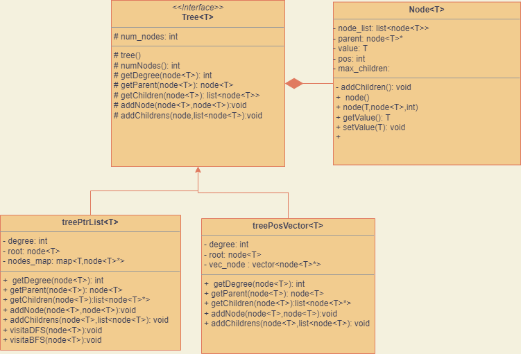

# data_structure
This is a project for a OOP course, it will be a data structure library and it allow to work with trees and graph.

# Class Edge
* mi conviene che ha due puntatori oppure due valori? 

# Problem 

* Come inizializzo gli elementi del vettore vuoto??  
    (posso provare con nullptr)
    * di default i puntatori sono già inizializzati a nullptr

# TODO 
- [ ] Provare a rifare il find(), find mi confronta i puntatori oppure i valori dei puntatori????

## node 

- [X] Implementare distruttore
    Non mi serve nessun distruttore in node, i nodi inseriti nella lista di adiacenza, sono di proprietà 
    di tree_general, tree non può allocare nodi per conto suo, ma si occupa solo di gestire le relazioni 
    con gli altri nodi. 


## tree_general 

- [X] Implementare distruttore 

## tree_pos_vector

- [ ] Implementation addNode()

Cosa deve fare? 
Deve aggiungere i nodi, inserendoli nel vettore posizione in maniera opportuna

//pre-conditions: 
    //1. the node x to add must be different from nullptr (non posso aggiungere un nodo nullo)
    //2. the node parent must exists if different from nullptr 
    //3. the parent nullptr means that x is the root if the root exists
    //   x will be the root 

    
- [ ] Implementation addChildren()
```cpp
    void tree_pos_vector<T>::addChildrens(const node<T>* _x, const std::list<node<T>> _childrens);
```

    Fondamentalmente quello che deve fare, è inserire i childrens nel nodo x.
    //pre-conditions
    //1. the node is inserted only if the num_children is < degree 
    //2. 
    
    //TODO 
    L'add children che ho implementato non funziona per l'utente ma solo per la struttura dati
    Implementarla anche dal lato utenta


- [ ] Implementation gedDegree()
- [ ] Implementation getChildren()
- [ ] Implementation Destructor

## Graph 


## graph_adj_list


