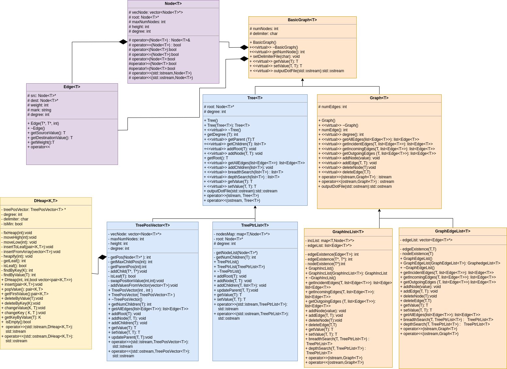

# Bradipo lib data_structure

## Compilation with linux

Move in the project root folder with you terminal.

Execute these commands: 
``` bash
mkdir build
cd build
cmake ..
make
```


## Uml class Diagram


